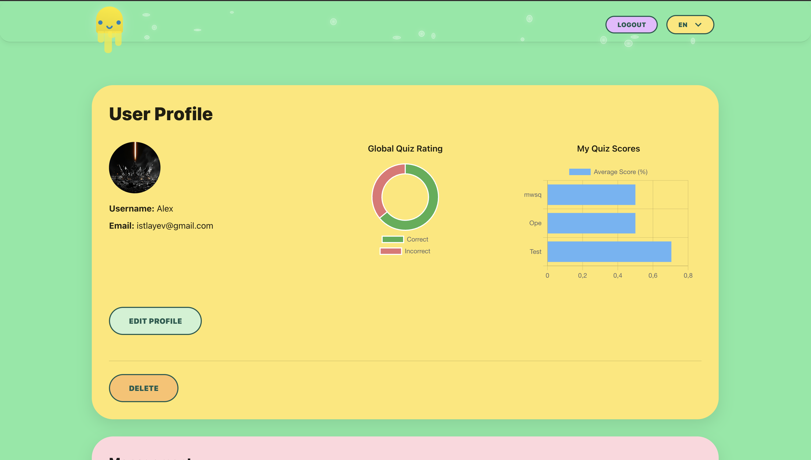
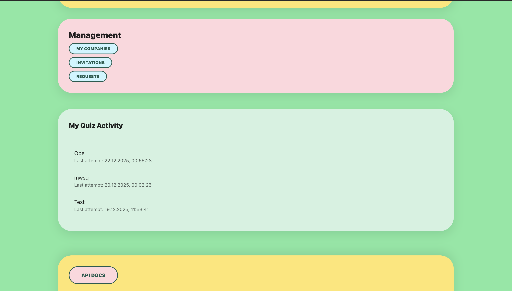
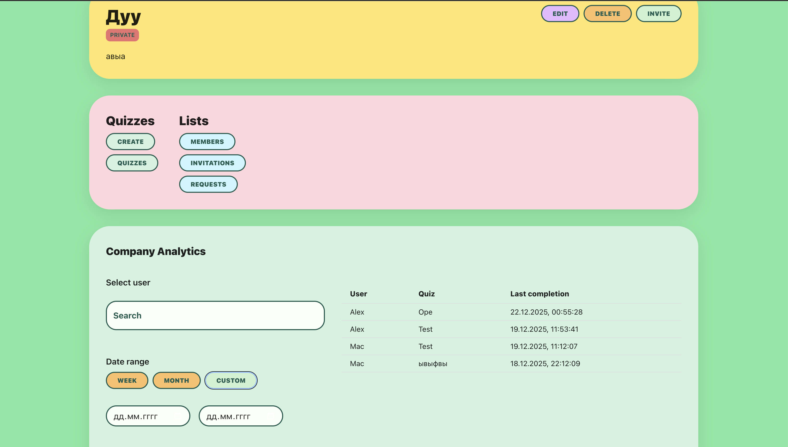

## Medduzen

Frontend application built with **React**, **TypeScript**, and **Material UI**.

## Technologies

- React
- TypeScript
- Vite
- Material UI
- dotenv

## Project Structure

- `src/components` — reusable components
- `src/pages` — application pages
- `src/api` — API layer
- `src/store` — global state (if needed)
- `src/utils` — helper functions

# Run Frontend with Docker

## 1. Copy environment variables

```bash
cp .env.sample .env
```

Edit values if needed (e.g. ports, app name).

## 2. Build Docker image

```bash
docker compose build
```

## 3. Start the container

```bash
docker compose up
```

App will be available at:

```
http://localhost:3000
```

(or the port defined in `.env`)

## 4. Stop the container

```bash
docker compose down
```

## 🧪 Run Locally

### 1. Install dependencies

```bash
npm install
```

### 2. Create .env file

```bash
cp .env.sample .env
```

Update values if needed.

### 3. Start dev server

```bash
npm run dev
```

App will be available at:

```
http://localhost:5173
```

(or the port shown in terminal)

## Tests

Run all tests

```bash
npm run test
```

$${\color{lightgreen}Result}$$

$\color{lightgreen}\small{\textbf{PASS}}$ src/tests/quizSlice.test.ts  
$\color{lightgreen}\small{\textbf{PASS}}$ src/tests/useQuizPage.test.ts  
$\color{lightgreen}\small{\textbf{PASS}}$ src/tests/QuizPage.test.tsx

---

Test Suites: $\color{lightgreen}\small{\textbf{3 passed}}$, 3 total  
Tests: $\color{lightgreen}\small{\textbf{10 passed}}$, 10 total

---

# AWS Deploy [DEMO](https://d12qdpj2fs00yu.cloudfront.net)

📦 Prerequisites

AWS Free Tier account

IAM user with permissions:

- S3 access

- CloudFront access

AWS CLI installed and configured

Verify AWS CLI:

```bash
aws --version
```

### 1. Build

Install dependencies and create a production build:

```bash
npm install
npm run build
```

### 2. Create S3 bucket

```bash
export BUCKET_NAME=meduzzen-frontend
export REGION=eu-central-1

aws s3 mb s3://$BUCKET_NAME --region $REGION
```

### 3. Enable Static Website Hosting

```bash
aws s3 website s3://$BUCKET_NAME \
  --index-document index.html \
  --error-document index.html
```

### 4. Allow public access

```bash
aws s3api put-public-access-block \
  --bucket $BUCKET_NAME \
  --public-access-block-configuration \
BlockPublicAcls=false,IgnorePublicAcls=false,BlockPublicPolicy=false,RestrictPublicBuckets=false
```

### 5. Apply policy

```bash
aws s3api put-bucket-policy \
  --bucket $BUCKET_NAME \
  --policy file://policy.json
```

### 6. Deploy project

```bash
aws s3 sync dist/ s3://$BUCKET_NAME --delete
```

### 7. Create CloudFront distribution

```bash
aws cloudfront create-distribution \
  --distribution-config file://cloudfront-config.json
```

### Check status

```bash
aws cloudfront list-distributions \
  --query "DistributionList.Items[].{ID:Id,Domain:DomainName,Status:Status}"
```

and wait until:

```text
Status: Deployed
```

### 8. Configure Auth0

CloudFront provides a secure HTTPS origin, required by Auth0.

#### Example CloudFront domain:

```text
https://d12qdpj2fs00yu.cloudfront.net
```

#### Allowed Callback URLs

```text
http://localhost:8080/auth/callback
https://d12qdpj2fs00yu.cloudfront.net/auth/callback
```

#### Allowed Logout URLs

```text
http://localhost:8080
https://d12qdpj2fs00yu.cloudfront.net
```

---

Current examples

### Home


### Users


### Companies


### Authorization


### Analytics




