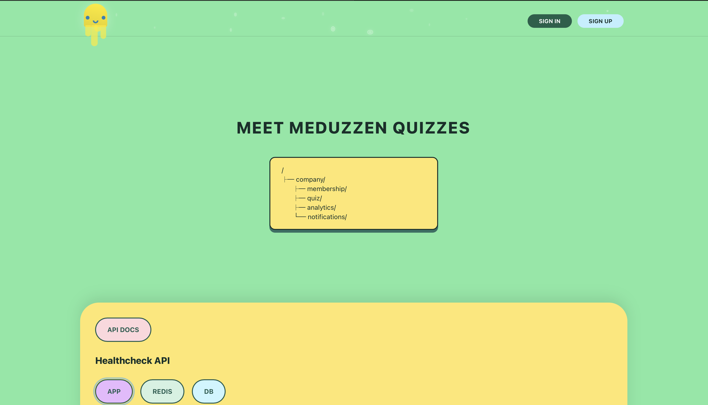

## Medduzen

Frontend application built with **React**, **TypeScript**, and **Material UI**.

## Technologies

- React
- TypeScript
- Vite
- Material UI
- dotenv

## Project Structure

- `src/components` — reusable components
- `src/pages` — application pages
- `src/api` — API layer
- `src/store` — global state (if needed)
- `src/utils` — helper functions

## Environment Variables

Create a `.env` file based on `.env.sample`:

```bash
cp .env.sample .env
```

Current example

