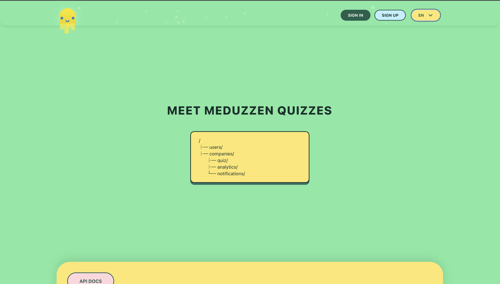
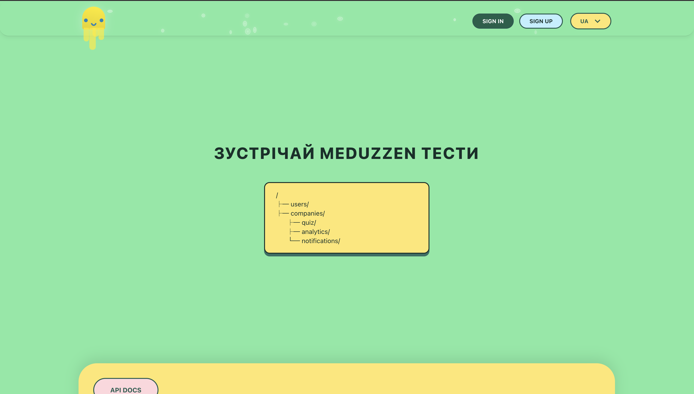
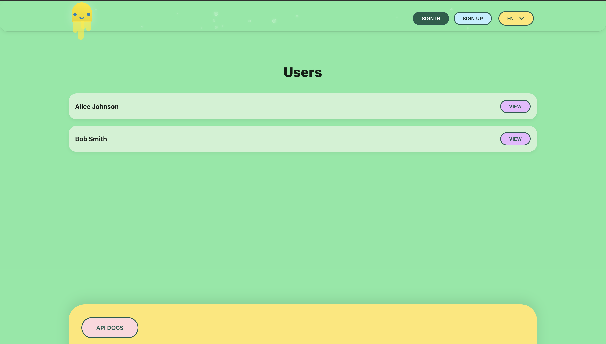
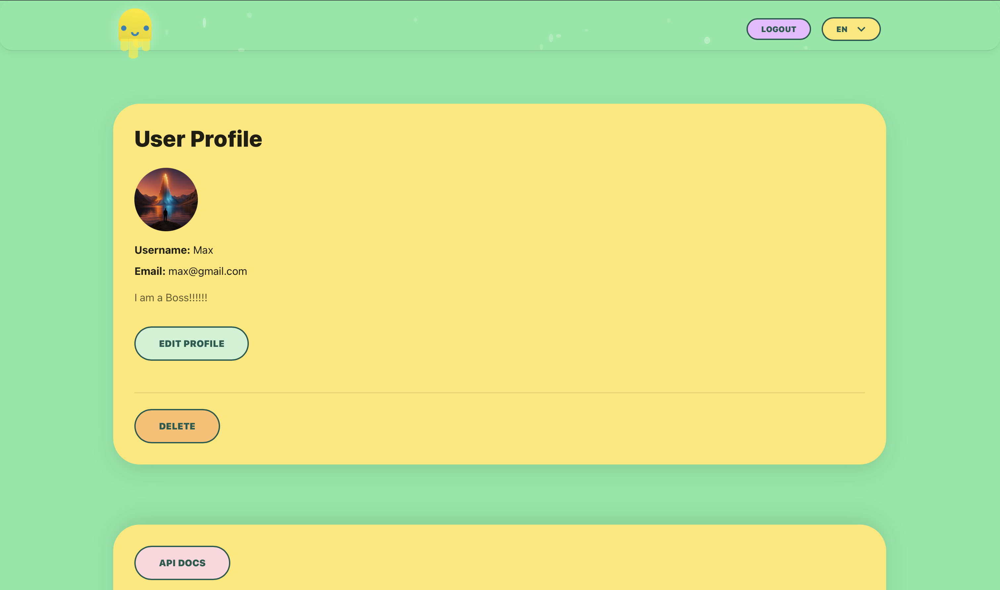
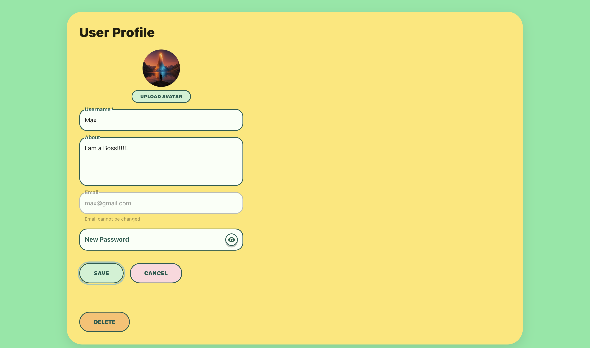
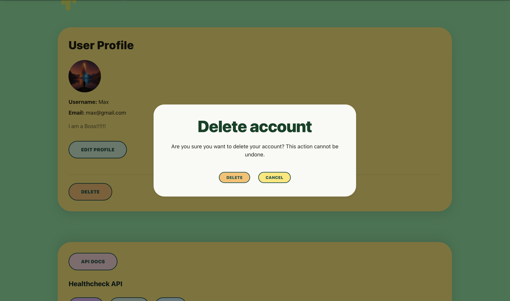
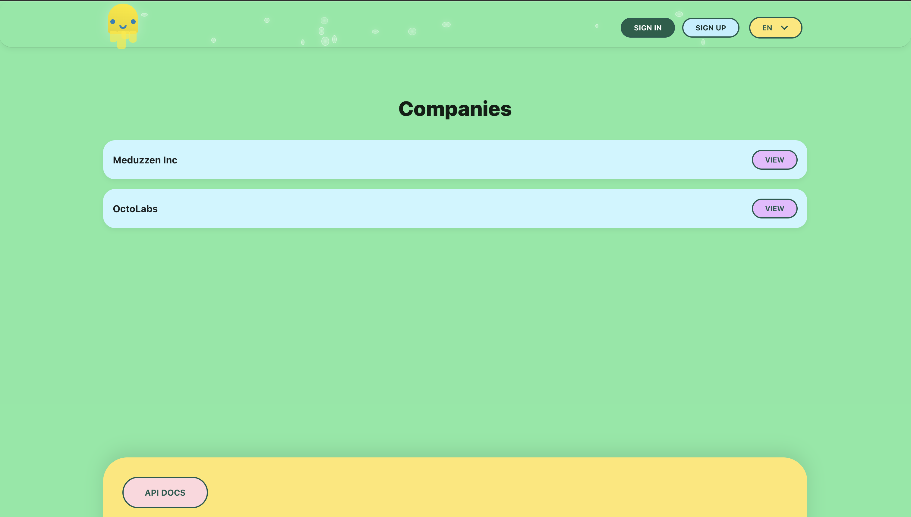
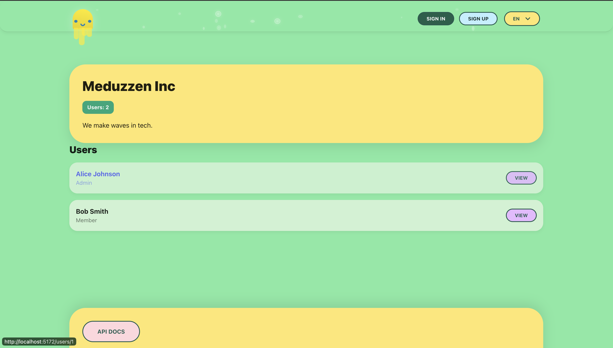
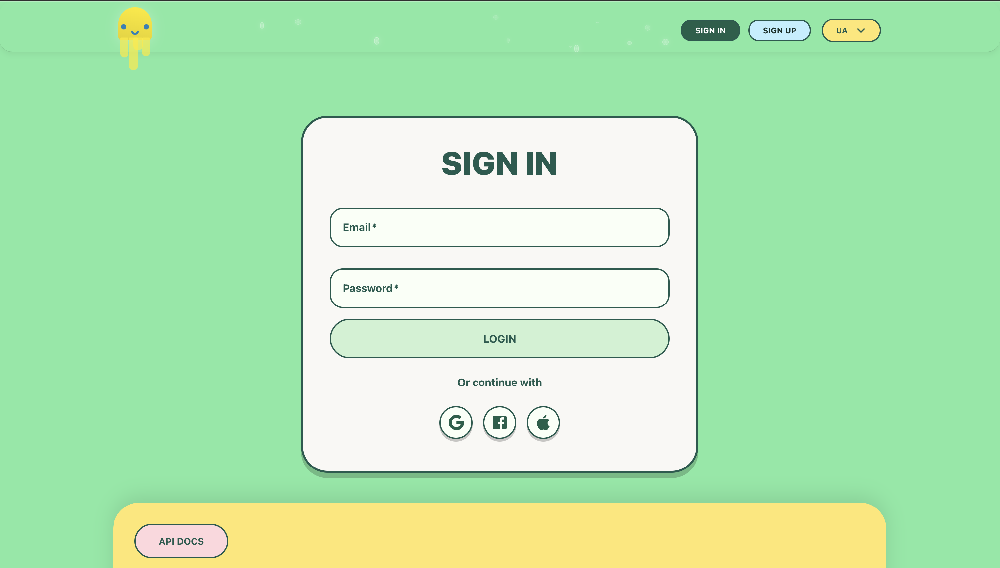
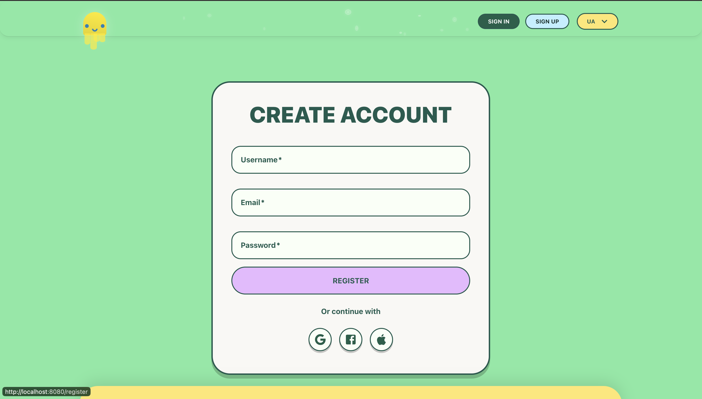

## Medduzen

Frontend application built with **React**, **TypeScript**, and **Material UI**.

## Technologies

- React
- TypeScript
- Vite
- Material UI
- dotenv

## Project Structure

- `src/components` — reusable components
- `src/pages` — application pages
- `src/api` — API layer
- `src/store` — global state (if needed)
- `src/utils` — helper functions

# Run Frontend with Docker

## 1. Copy environment variables

```bash
cp .env.sample .env
```

Edit values if needed (e.g. ports, app name).

## 2. Build Docker image

```bash
docker compose build
```

## 3. Start the container

```bash
docker compose up
```

App will be available at:

```
http://localhost:3000
```

(or the port defined in `.env`)

## 4. Stop the container

```bash
docker compose down
```

## 🧪 Run Locally

### 1. Install dependencies

```bash
npm install
```

### 2. Create .env file

```bash
cp .env.sample .env
```

Update values if needed.

### 3. Start dev server

```bash
npm run dev
```

App will be available at:

```
http://localhost:5173
```

(or the port shown in terminal)

---

Current examples

### Home




### Users






### Companies




### Authorization



